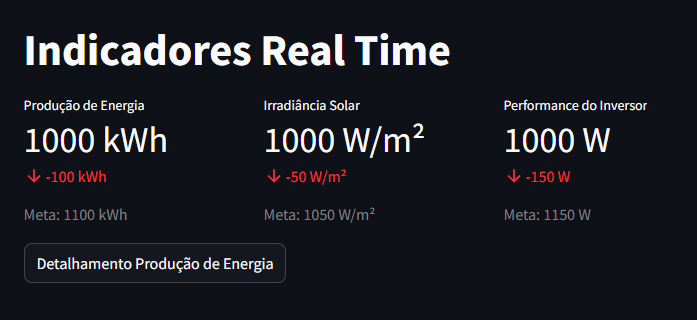
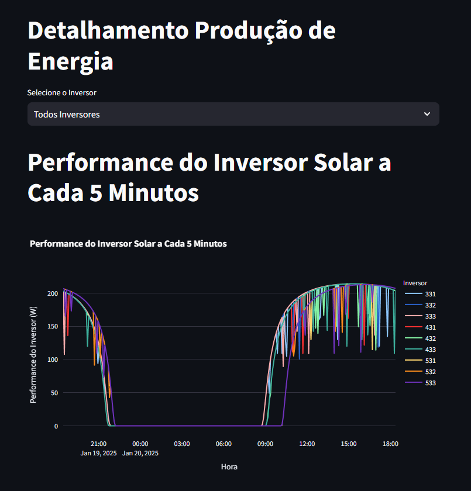
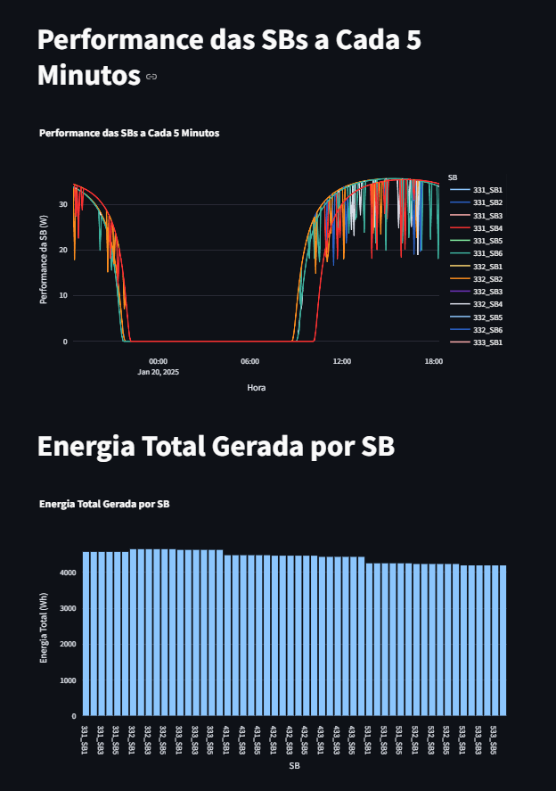
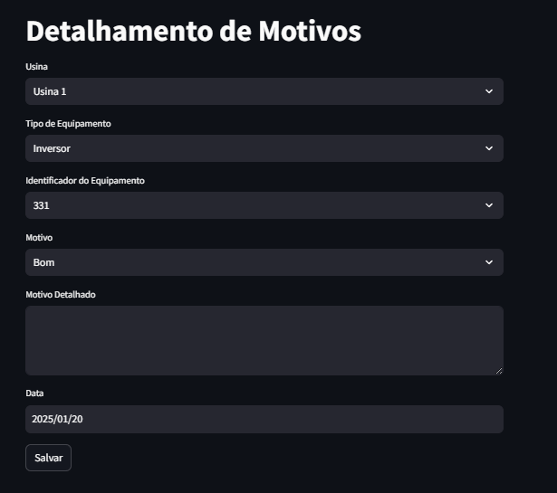

# Monitoramento_Streamlit

Um exemplo de como utilizar Streamlit para monitorar dados em tempo real.

## Descrição

Este projeto demonstra como usar o Streamlit para criar uma aplicação de monitoramento em tempo real de dados de produção de energia solar. A aplicação exibe indicadores de desempenho, gráficos de produção de energia e permite a análise detalhada de motivos de falhas.

## Funcionalidades

- **Indicadores em Tempo Real**: Exibe métricas de produção de energia, irradiância solar e performance dos inversores.
- **Gráficos de Produção de Energia**: Gráficos de barras e linhas para visualizar a produção de energia nas últimas 24 horas.
- **Detalhamento de Produção de Energia**: Análise detalhada da performance dos inversores e motivos de falhas.
- **Comparação de Potência Pico e Energia Atual**: Gráficos comparativos para analisar a potência pico do último mês e a energia atual.

## Instalação

1. Clone o repositório:
    ```sh
    git clone https://github.com/seu-usuario/Monitoramento_Streamlit.git
    ```
2. Navegue até o diretório do projeto:
    ```sh
    cd Monitoramento_Streamlit
    ```
3. Instale as dependências:
    ```sh
    pip install -r requirements.txt
    ```

## Uso

1. Execute a aplicação Streamlit:
    ```sh
    streamlit run Hub\ Performance.py
    ```
2. Acesse a aplicação no seu navegador em `http://localhost:8501`.

## Estrutura do Projeto

- `Hub Performance.py`: Código principal da aplicação Streamlit.
- [README.md](http://_vscodecontentref_/3): Este arquivo.
- `requirements.txt`: Lista de dependências do projeto.

## Exemplo de Uso

### Indicadores em Tempo Real



### Gráficos de Produção de Energia



### Detalhamento de Produção de Energia



### Sistema de Registro de ocorrências e justificativas



